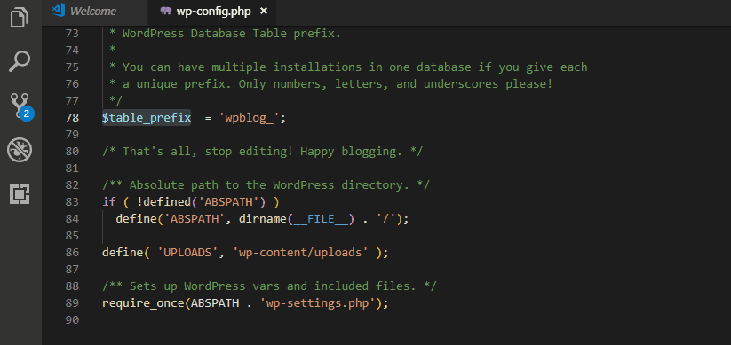

# Easy PHP Error Logger

Easily print_r a variable to your project's error log in PHP.

## Features

Simply highlight a variable and press ctrl+alt+d. Two new lines will be added below the highlighted line; one to label the variable so you can easily identify it in the log file and another to print human-readable information about the variable with print_r. You can also run the command from the command palette (ctrl+shift+p) by typing "Error log".

## Release Notes

### 1.0.0

Initial release of Easy PHP Error Logger